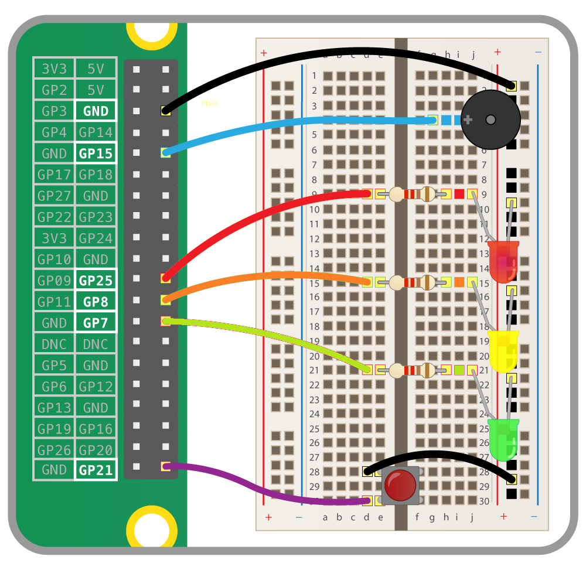

## Connect the traffic lights

For this worksheet you'll need a breadboard, three LEDs, a button, a buzzer, and the necessary jumper cables and resistors. You can purchase these individually, or get everything you need in the [CamJam EduKit](https://thepihut.com/products/camjam-edukit){:target="_blank"}.

### Wiring

To get started, you'll need to place all the components on the breadboard and connect them to the appropriate GPIO pins on the Raspberry Pi.

+ First, you need to understand how each component is connected:

    - A push button requires 1 ground pin and 1 GPIO pin
    - An LED requires 1 ground pin and 1 GPIO pin, with a current limiting resistor
    - A buzzer requires 1 ground pin and 1 GPIO pin

    Each component requires its own individual GPIO pin, but components can share a ground pin. We will use the breadboard to enable this.

+ Place the components on the breadboard and connect them to the Raspberry Pi GPIO pins, according to the following diagram:

    

    Note that the row along the long side of the breadboard is connected to a ground pin on the Raspberry Pi, so all the components in that row (which is used as a ground rail) are hence connected to ground.

+ Observe the following table, showing which GPIO pin each component is connected to:

| Component | GPIO pin |
| --------- | :------: |
| Button    | 21       |
| Red LED   | 25       |
| Amber LED | 8        |
| Green LED | 7        |
| Buzzer    | 15       |